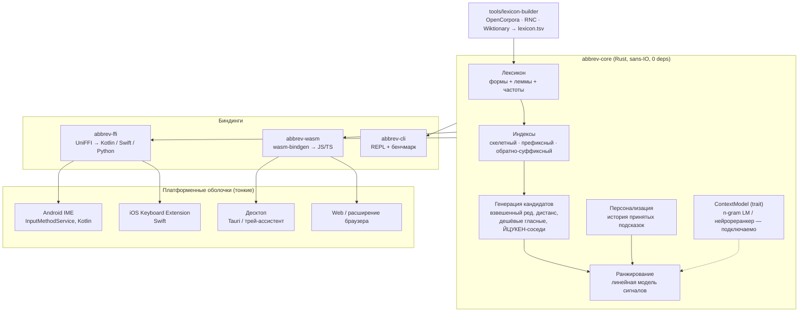
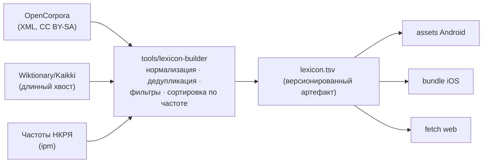

# Архитектура: кросс-платформенная аббревиатурная IME для русского языка

Приложение восстанавливает полные слова из согласного/сокращённого ввода
(`првт → привет`, `тстрние → тестирование`), ранжирует кандидатов и учится на
выборе пользователя. Архитектура следует выводам обзора литературы (см.
`docs/RESEARCH.md`): **символьная генерация кандидатов + лёгкое ранжирование**,
а не end-to-end нейросеть; всё — офлайн и на устройстве.

## 1. Принципы

1. **Ядро на Rust, оболочки тонкие.** Вся лингвистика, ранжирование и
   персонализация живут в одном переносимом крейте `abbrev-core`. Платформенные
   оболочки (Android IME, iOS, десктоп, web) занимаются только вводом, отрисовкой
   подсказок и хранением блобов.
2. **Sans-IO ядро.** `abbrev-core` не трогает файлы, сеть, часы и потоки.
   Оболочка подаёт лексикон строкой/байтами, забирает подсказки и блоб истории.
   Это делает ядро тривиально тестируемым и компилируемым под любой таргет.
3. **Ноль зависимостей в ядре.** Только `std`. Малый размер бинаря, быстрая
   сборка под `aarch64-linux-android`, `wasm32`, iOS и десктоп без сюрпризов.
4. **Офлайн и приватность по умолчанию.** Никакой телеметрии. История принятых
   подсказок — локальный артефакт; ядро лишь экспортирует/импортирует её,
   решение о хранении принимает оболочка.
5. **Детерминизм.** Один и тот же лексикон + история + ввод ⇒ один и тот же
   список подсказок. Это условие воспроизводимых бенчмарков и отладки.
6. **Метрики прежде моделей.** Любое усложнение (контекстная LM, нейрореранкер)
   принимается только если двигает top-1/top-3/латентность на офлайн-бенчмарке
   (`abbrev bench`).

## 2. Обзор системы



Поток данных при наборе: оболочка на каждое нажатие вызывает
`suggest(input, context, limit)` → ядро отдаёт ранжированные `Suggestion{form,
lemma, score}` → оболочка рисует строку подсказок; по принятию вызывает
`accept(input, form)`; по таймеру/выходу сохраняет `export_history()`.

## 3. Структура репозитория

```
crates/
  abbrev-core/      # движок: вся логика, ноль зависимостей
  abbrev-ffi/       # UniFFI-объект AbbrevEngine для Kotlin/Swift
  abbrev-wasm/      # wasm-bindgen-обёртка для web/webview
  abbrev-cli/       # dev-CLI: suggest, repl, bench
tools/
  lexicon-builder/  # офлайн-конвейер сборки лексикона
platforms/
  android/          # оболочка Android IME (Kotlin)
  ios/              # оболочка iOS Keyboard Extension (Swift)
  desktop-tauri/    # десктопная оболочка
  web/              # web-демо / расширение
data/
  bench/            # офлайн-бенчмарки (input → expected)
docs/
  ARCHITECTURE.md   # этот документ
  adr/              # architecture decision records
```

Правило зависимостей: `platforms/* → биндинги → abbrev-core`. Стрелок в
обратную сторону не бывает; ядро не знает о платформах.

## 4. Ядро: пять слоёв

Соответствие «пятислойному MVP» из исследования — прямое.

### 4.1 Слой лексикона (`lexicon.rs`)

Поверхностные **словоформы — объекты первого класса** (русские подсказки обязаны
уважать окончания); лемма хранится на каждой форме для группировки и UI
«подержать — увидеть формы». Формат артефакта: TSV `form\tlemma\tfreq`,
собирается `lexicon-builder` из OpenCorpora (база), Wiktionary (длинный хвост)
и частот НКРЯ (приоры). В ядро встроен малый демо-лексикон для тестов и демо.

Эволюция: TSV → версионированный бинарный формат (mmap, FST) — меняется только
загрузчик, см. ADR-0004.

### 4.2 Слой индексов (`index/`)

Три индекса — три инстанса одного упорядоченного префиксного мультиотображения
(`PrefixMap`, BTreeMap + range-scan):

| Индекс | Ключ | Закрывает |
|---|---|---|
| скелетный | согласный скелет формы (`привет → првт`) | `првт`, агрессивные сокращения |
| префиксный | нормализованная форма | обычное автодополнение |
| обратно-суффиксный | развёрнутая форма | маршрутизацию по окончаниям `-ние`, `-ость`, `-ция`… (идея reverse-suffix-trie из линии MyStem/Сеголовича) |

Нормализация всюду одна: lowercase + `ё→е`; скелет дополнительно отбрасывает
гласные и `ь/ъ`. `PrefixMap` — единственное место для замены на FST/DAWG, если
профилирование на устройстве этого потребует.

### 4.3 Слой генерации кандидатов (`engine::collect_candidates` + `edit.rs`)

Объединение бакетов с кэпом на источник (ограниченная работа на нажатие):

1. скелет точно + по префиксу скелета (+ укороченный на одну согласную префикс —
   покрывает расхождение хвостовых согласных: `тстрн` vs `тстрвн`);
2. префикс формы (дополнение);
3. суффиксный бакет по самому длинному известному окончанию ввода.

Фильтр — **взвешенный Дамерау–Левенштейн** (noisy channel) с ранним отсечением:
вставка гласной 0.25, `ь/ъ` 0.35, согласной 1.0; замена ЙЦУКЕН-соседей 0.5,
гласная↔гласная 0.55; транспозиция 0.6; лишний символ ввода 1.1. Направление
стоимостей фиксировано: «вставка» = «пользователь это опустил». Порог растёт с
длиной ввода (`base + per_char·len`).

### 4.4 Слой ранжирования (`rank.rs`, `history.rs`, `context.rs`)

Линейная модель — прямой синтез литературы по spelling correction и pinyin-IME:

```text
score = w_skel·skeleton_match + w_suf·suffix_compat + w_pref·prefix_agreement
      − w_edit·edit_distance + w_freq·ln(1+ipm) + w_ctx·context_lm
      + w_user·user_prior
```

* `skeleton_match` — градуированный: точное совпадение скелетов = 1.0, иначе
  доля скелета ввода, совпавшая с начала (`тстрн` vs `тстрвн` → 0.8; vs
  `нстрн` → 0). Пользователь сохраняет первые согласные основы, поэтому вес
  скелета выше веса частоты: для `тстрния` побеждает `тестирования`, а не более
  частотная `история`.
* **Окончание выбирает форму**: суффиксный сигнал + дешёвые правки гласных дают
  `тстрние → тестирование`, `тстрния → тестирования`, `тстрнию → тестированию`
  (закреплено тестами и бенчмарком).
* `prefix_agreement` — кандидат, буквально начинающийся с введённого, получает
  бонус: чистое дополнение `степ → степени` не должно проигрывать частотному
  fuzzy-соседу `стоп` (добавлен по результатам генеративного бенчмарка).
* **Защищённый ввод** («если не уверен — не трогай»): цифры, латиница, `_`,
  e-mail, URL и код не получают подсказок вовсе.
* Контекст — `trait ContextModel`; в MVP — заглушка `NoContext`, далее компактная
  n-gram LM, затем (опционально) квантованный нейрореранкер. Ядро не меняется.
* Персонализация — `UserHistory`: счётчики «скелет ввода → принятая форма» +
  глобальная популярность формы, логарифмический приор. Сериализация в TSV-блоб,
  хранение — на стороне оболочки.
* Морфологический сигнал (`w_morph`) зарезервирован до появления
  парадигмо-сознательного лексикона; пока его несёт суффиксная совместимость.

Веса подбираются по бенчмарку, не интуицией.

### 4.5 Слой UI-контракта (`engine.rs`)

API ядра намеренно мал — это и есть контракт всех фронтендов:

```rust
Engine::new(lexicon) / with_config(...)
suggest(&self, input, &Context, limit) -> Vec<Suggestion>       // плоский список
suggest_grouped(&self, input, &Context, limit)
    -> Vec<SuggestionGroup { lemma, best, variants }>           // двухуровневая лента
forms_of_lemma(&self, lemma) -> Vec<String>                     // «подержать — формы»
accept(&mut self, input, form)                                  // обучение на выборе
export_history() / import_history(blob)                         // персистентность — оболочке
set_context_model(Box<dyn ContextModel>)                        // подключаемый контекст
```

UI-модель ленты кандидатов: **горизонталь = разные леммы, вертикаль (hold) =
формы одной леммы**. `best` в группе выбирается ранжированием, то есть набранное
окончание само выбирает форму; список `variants` раскрывается по удержанию.

## 5. Граница FFI: один движок — любые фронтенды

| Платформа | Транспорт | Крейт | Оболочка |
|---|---|---|---|
| Android (IME) | UniFFI → Kotlin, `.so` (cdylib) | `abbrev-ffi` | `platforms/android` |
| iOS (Keyboard Extension) | UniFFI → Swift, `.a` (staticlib) | `abbrev-ffi` | `platforms/ios` |
| Web / расширение | wasm-bindgen → JS/TS | `abbrev-wasm` | `platforms/web` |
| Десктоп (Tauri/webview) | wasm-bindgen или нативно (Rust в процессе) | `abbrev-wasm` / напрямую `abbrev-core` | `platforms/desktop-tauri` |
| Десктоп (нативный ассистент в духе lay-public) | напрямую `abbrev-core` | — | будущее |
| Скрипты/исследования | UniFFI → Python | `abbrev-ffi` | — |

Выбор UniFFI + wasm-bindgen зафиксирован в ADR-0003. `AbbrevEngine` в
`abbrev-ffi` оборачивает ядро в `Mutex`: колбэки IME приходят из разных потоков,
само ядро однопоточное.

## 6. Платформенные оболочки

### Android (первая цель)

`InputMethodService` на Kotlin + строка подсказок. Обязанности оболочки:

* раскладка/клавиши, событие `onUpdateSelection`, вставка принятой формы;
* вызов `suggest()` на нажатие (порог ≥ 3 символов держит ядро; долгое нажатие
  по подсказке → `formsOfLemma()` → попап со словоформами);
* загрузка лексикона из assets при старте сервиса (один раз, в память);
* персистентность истории: `exportHistory()` → файл в app-private storage
  (запись по `onFinishInput`/таймеру), `importHistory()` при старте;
* настройки: мин. длина, чёрный/белый списки, выключатель обучения.

Сетевые разрешения у IME-процесса отсутствуют — приватность проверяема.

### iOS, десктоп, web

Те же обязанности при том же контракте: iOS Keyboard Extension (Swift, статическая
линковка, лимит памяти расширения ~60 МБ — аргумент за компактный бинарный
лексикон); web-демо — самый дешёвый способ показать движок и собрать фидбек;
десктоп — Tauri-приложение или, позже, нативный трей-ассистент в духе lay-public.

## 7. Конвейер данных (офлайн, не на устройстве)



Сейчас реализован импорт свободного TSV/CSV (`form;lemma;freq` или `form;freq`);
импортёры OpenCorpora-XML и частотных списков НКРЯ — следующий шаг конвейера.
Артефакт лексикона версионируется и собирается в CI, на устройстве никогда не
строится.

## 8. Оценка качества

Пять метрик зафиксированы как обязательные; четыре уже измеряются командой
`cargo run -p abbrev-cli -- bench data/bench/basic.tsv`:

| Метрика | Статус |
|---|---|
| top-1 точность на изолированных сокращениях | ✅ в bench |
| top-3 recall (строка подсказок — не winner-take-all) | ✅ в bench |
| латентность mean/p95 | ✅ в bench |
| экономия нажатий (keystroke savings) | планируется в bench |
| качество групп форм («подержать — формы») | ручная проверка + тесты ядра |

Два контура: приёмочный набор `data/bench/basic.tsv` (22 кейса, обязан держать
100% — регрессия контракта) и **генеративный бенчмарк** — `abbrev gen` портит
реальные частотные слова по типологии сокращений (первая буква живёт, гласные
выпадают, окончание защищается, усечение, опечатки) и меряет движок на десятках
тысяч кейсов с разбивкой по правилам. Текущие честные цифры на лексиконе 48k
форм — в [BENCHMARKS.md](BENCHMARKS.md): top-1 71.8%, top-3 85.1%, p95 ≈ 3 мс;
главная выявленная дыра — ретривал при опечатке в согласной (ломается скелет).

## 9. Дорожная карта

1. **Сейчас (каркас)** — ядро с пятью слоями, CLI, бенчмарк, FFI/WASM-обвязка. ✅
2. **Лексикон** — импортёр OpenCorpora + частоты НКРЯ; бинарный формат; бенчмарк
   на 10⁵+ форм; тюнинг весов и стоимостей по bench.
3. **Android MVP** — оболочка IME, загрузка лексикона из assets, персистентная
   история, настройки.
4. **Контекст** — компактная n-gram LM за `ContextModel`; межсловное ранжирование.
5. **Морфология** — парадигмы из OpenCorpora: сигнал `w_morph`, теги форм в
   hold-списке, умная фильтрация «морфологической свалки».
6. **Языковые профили** — вынести русскоязычные части (`alphabet.rs`, список
   окончаний, стоимости правок) за trait `LanguageProfile`: ядро остаётся
   языконезависимым, русский — первый плагин, далее английский (включая
   фразовый/acronym-режим `SYL → see you later`) и др.
7. **Устойчивость к опечаткам** — delete-индекс в духе SymSpell поверх
   скелетов: опечатка в согласной сейчас ломает ретривал кандидатов
   (см. BENCHMARKS.md, срез `typo`).
8. **Продвинутое** — нейрореранкер (квантованный), фразовые сокращения,
   осторожная автозамена (по margin-политике top1−top2), iOS/десктоп/web-оболочки.

## 10. Решения (ADR)

| ADR | Решение |
|---|---|
| [0001](adr/0001-rust-core-thin-shells.md) | Rust-ядро + тонкие платформенные оболочки |
| [0002](adr/0002-sans-io-zero-dependency-core.md) | Sans-IO ядро без зависимостей |
| [0003](adr/0003-uniffi-wasm-bindings.md) | UniFFI + wasm-bindgen как граница FFI |
| [0004](adr/0004-lexicon-artifact-format.md) | TSV-артефакт лексикона с путём к бинарному формату |
