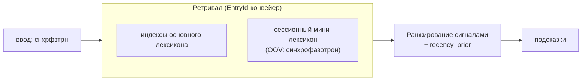

# Исследование: контекстный recency-кэш («слово из этого разговора»)

Конспект обзора и проектное решение для функции **контекстно-зависимых
подсказок**: слово, употреблённое в текущем разговоре/приложении, начинает
всплывать в подсказках именно там, где его набрали, и затухает, когда тема
ушла. Мотивирующий кейс: «синхрофазотрон» один раз набран в чате — в этом чате
он редкий по корпусу, но почти гарантированно повторится.

Документ продолжает [RESEARCH.md](RESEARCH.md) и опирается на швы ядра из
[ARCHITECTURE.md](ARCHITECTURE.md) (`trait ContextModel`, `UserHistory`,
`collect_candidates`). Принцип проекта сохраняется: **метрики прежде моделей** —
ниже зафиксирован способ померить эффект до того, как усложнять ядро.

## 1. Это известная техника, а не догадка

То, что повтор слова резко поднимает вероятность следующего повтора, —
устойчивый факт корпусной лингвистики, у него есть имена и зрелые реализации.

| Линия | Суть | Что берём |
|---|---|---|
| **Cache language model** (Kuhn & De Mori, 1990) | к статической LM подмешивается кэш недавно виденных слов: `P = λ·P_cache + (1−λ)·P_static` | сам приём «недавнее вероятнее»; адаптируем под линейную модель сигналов |
| **Burstiness / self-trigger** (Church & Gale; Katz, 1996; Rosenfeld, 1996) | контентное слово «вспыхивает» в документе: после первого появления вероятность повтора кратно выше; сильнейший триггер слова — оно само | теоретическое обоснование, почему одного употребления достаточно |
| **Экспоненциально затухающий кэш** (Clarkson & Robinson, 1997) | вес виденного слова `∝ exp(−α·Δ)` по расстоянию назад Δ | форма функции затухания (half-life) |
| **Адаптивные/динамические словари в проде** (Gboard «learned words»/personal dictionary, Hard et al. 2018; SwiftKey; iOS QuickType) | клавиатура подхватывает слова вне словаря и поднимает недавние; персонализация на устройстве | подтверждение реализуемости; разделение «выучить слово» (ретривал) и «поднять недавнее» (ранжирование) |
| **OOV / dynamic vocabulary** | новые слова, которых нет в фиксированном словаре, должны быть *достижимы*, а не только переранжированы | прямой источник Части 2 ниже |

Вывод обзора: функция реализуема и стандартна; нетривиальна не языковая модель,
а **(a)** достижимость слов вне лексикона и **(b)** определение границы
«этого разговора» из-под IME.

## 2. Архитектурный раскол: ретривал ≠ ранжирование

Жёсткий факт из кода. `engine::collect_candidates` работает на `EntryId` —
индексах в **неизменяемый** `Lexicon`; `ContextModel::score` вызывается уже на
найденных кандидатах. Отсюда:



* Если слово **в лексиконе** — достаточно добавить recency-сигнал в ранжирование
  (Часть 1). Несколько строк.
* Если слова **в лексиконе нет** — `ContextModel` для него никогда не вызовется,
  потому что ретривал его не достанет. Нужен сессионный источник кандидатов
  (Часть 2). Это основная работа.

## 3. Часть 1 — recency-сигнал в ранжировании

Малоинвазивный путь: повторить паттерн `user_prior` / `w.user`. Recency и есть
«история, но эфемерная и с затуханием».

**Sans-IO ⇒ затухание по логическому тику, не по часам.** ADR-0002 запрещает
ядру трогать часы; §1.5 ARCHITECTURE требует детерминизма. Поэтому «давно»
меряется в *числе виденных слов*, а не в секундах: оболочка гонит поток
закоммиченных слов, ядро ведёт счётчик. Тот же поток детерминирует тесты и
бенчмарк.

```rust
// recency.rs — эфемерно, sans-IO, затухает по логическому тику.
pub struct SessionCache {
    tick: u64,                       // +1 на каждое наблюдённое слово
    last_seen: HashMap<String, u64>, // нормализованная форма -> tick
    half_life: f32,                  // в словах; задаёт оболочка (напр. 80)
}

impl SessionCache {
    pub fn note(&mut self, word: &str) {        // закоммиченное слово контекста
        self.tick += 1;
        self.last_seen.insert(normalize(word), self.tick);
    }
    pub fn prior(&self, form_norm: &str) -> f32 { // [0,1]: 1.0 — только что
        match self.last_seen.get(form_norm) {
            Some(&t) => 0.5f32.powf((self.tick - t) as f32 / self.half_life),
            None => 0.0,
        }
    }
    pub fn reset(&mut self) { self.tick = 0; self.last_seen.clear(); }
}
```

Проводка — как `morph`/`user` (`rank.rs` + `engine.rs:261`): новое поле
`Weights::recency`, новый `Signals::recency_prior`, слагаемое
`+ w.recency * s.recency_prior` в `score()`, заполнение
`recency_prior: self.session.prior(&form_norm)` в `scored()`.

**Почему слагаемое, а не мешок-смесь.** Классический cache-LM — линейная смесь
`λ·P_cache + (1−λ)·P_static`. Ядро уже линейно по сигналам, поэтому встраиваем
recency как ещё один аддитивный сигнал с весом `w_recency`, подбираемым на
бенчмарке (как все веса — §4.4). Сигнал ограничен `[0,1]`, как PMI ограничен
`MAX_PMI` в `ngram.rs`: один контекстный сигнал не должен перебивать все
остальные разом.

## 4. Часть 2 — OOV-ретривал (вариант B: параллельный путь) — **сделано**

> **Статус: реализовано** (вариант B). `SessionCache` хранит display-форму и
> предпосчитанный скелет каждого слова сессии; `Engine::oov_suggestions` сканирует
> их, отсеивает уже-словарные (`by_form.exact`) и скорит той же линейной моделью
> (freq=0, плавучесть от `recency_prior`), а внутренний `enum Ranked` мержит
> лексикон+OOV по score в `suggest`/`suggest_grouped`. `EntryId`-конвейер не
> тронут. Новой FFI/WASM-поверхности не нужно — слова кормит уже существующий
> `note_word`. Живой пример: `note_word("синхрофазотрон")` → `снхрфзтрн`
> достаёт `синхрофазотрон` (юнит-тесты в `engine.rs`).

Слова нет в `Lexicon` ⇒ нет `EntryId` ⇒ весь конвейер его не видит
(`self.lexicon.get(id)`). Рассмотренные варианты:

* **(A) `EntryId` → enum `{ Lexicon(u32), Session(u32) }`.** Точнее всего, но
  трогает `scored`, `collect_candidates`, `by_lemma`, индексы — много мест.
* **(B, рекомендуется) Параллельный путь.** Сессионные слова живут в отдельном
  маленьком хранилище; прогоняются через тот же scoring и отдаются как
  `Suggestion` **напрямую**, минуя общий `EntryId`-merge. `suggest()` сливает два
  потока `Suggestion` по score. Существующий конвейер не трогается вовсе —
  добавляется второй проход и merge в `suggest`/`suggest_grouped`.

Сессионный словарь крошечный (сотни слов на разговор), поэтому полноценные
`Indexes` не нужны: достаточно линейного скана по скелету/префиксу. Дедуп: если
слово уже есть в основном лексиконе, в OOV-путь оно не идёт — только в recency
Части 1 (иначе дубль в ленте).

**Синтетическая частота OOV — переиспользуем приём имён.** У сессионного слова
нет `freq`/`lemma`/`tags`, значит `log_frequency = 0`, `morph = user = ctx = 0`;
плавучесть ему даёт `recency_prior`. Это ровно паттерн `data/lexicons/ru-names.tsv`
(§7 ARCHITECTURE): плоский низкий приор, так что **реальное частотное слово всегда
выигрывает омограф, но OOV-слово достижимо**. И поведение получается желаемым: пока
тему обсуждают — recency держит слово вверху; тема ушла — recency затух, слово
осело ниже словарных. Кэш сам себя чистит ранжированием.

**Защищённый ввод не меняется.** `is_protected_safe` по-прежнему молчит на
латинице/цифрах/коде; `note_word` оболочка зовёт только на закоммиченных русских
словах. Слова вроде `API` в OOV-кэш не попадают (и не должны — это зона «не
уверен — не трогай»).

Первый шаг можно ограничить заглушкой-`trait` под вариант B (источник
кандидатов), чтобы не зашивать решение про `EntryId` впопыхах — рефактор (A)
остаётся открытым, если профилирование потребует единого конвейера.

## 5. Часть 3 — граница «этого разговора»: per-app — **сделано**

> **Статус: реализовано** в Android IME (`AbbrevImeService`): `noteWord` на
> закоммиченных словах (принятая подсказка + слово на сепараторе), `resetSession`
> при смене `EditorInfo.packageName`. Per-app, эфемерно. Детали — в
> `platforms/android/README.md`.

Ядро получает поток слов (`note`) и команду `reset`. Что считать «контекстом» —
решает оболочка, и здесь честный предел: **IME видит текстовое поле в
приложении, а не тред.** Надёжно доступно из `InputMethodService`:

| Сигнал оболочки | Доступность | Роль |
|---|---|---|
| package приложения (`EditorInfo.packageName`) | надёжно | ключ per-app кэша |
| смена поля ввода (`onStartInput`/`onFinishInput`) | надёжно | момент `reset()` / переключения кэша |
| конкретный тред внутри мессенджера | **недоступно** | — |

Поэтому реализуем **per-app**, а «этот чат» аппроксимируем окном: `half_life` в
словах + `reset()` при смене приложения. Эффект «синхрофазотрон всплывает, пока я
про него пишу» достигается; точная привязка к треду — нет, и это ограничение
платформы, а не ядра.

Семантика per-app — выбор оболочки, ядро sans-IO к нему безразлично:

* **эфемерный** (по умолчанию, «сессия»): кэш в памяти, сбрасывается при рестарте
  IME и при смене package. Максимум приватности, ноль персиста.
* **персистентный per-app** (как Gboard learned words): оболочка хранит блоб
  кэша на package в app-private storage и поднимает при возврате в приложение.
  Тогда «синхрофазотрон» переживает закрытие чата. Это уже ближе к *персональному
  словарю*, чем к сессии, — см. открытый вопрос §8 про «выпускной» в `UserHistory`.

В обоих случаях **кэш не уходит в синк**: в отличие от `UserHistory` (CRDT-merge
между устройствами), `SessionCache` локален и эфемерен, `merge`/`export` для него
не определены. Приватность — бесплатно и проверяемо (у IME-процесса нет сети).

### 5.1 Регистр/тон: его дают не по chat-id, а по содержимому

> **Статус: измеритель тона реализован** (ранжирующий сигнал — следующий шаг).
> `tone.rs` (`ToneMeter`) читает тот же поток `note_word`, что и recency: build-time
> список знаковых маркеров (`data/tone/ru.tsv`, полюс `+` вежливо ↔ `−` грубо),
> два экспоненциально затухающих по тику аккумулятора → скаляр `tone ∈ [−1,1]` и
> грубый `Register {Polite, Neutral, Crude}` с порогом и порогом уверенности.
> Без chat-id, без новых разрешений — тон считается из содержимого окна.
> Первый клиент — **тон-гейт маскирования** (§5.2): `EngineConfig.mask_when_polite`
> отдаёт маск-двойник только в вежливом окне (маме цензурим, другу — нет).
> CLI: `--tone <list>`, `--mask-when-polite`, `--window "слова окна"`;
> `abbrev suggest` печатает `register`/`tone`. Открыт вопрос §8 «как мерить тон»
> зафиксирован консервативно (знаковый список + затухание); **ранжирующий**
> register-сигнал (буст сленг ↔ нейтраль) отложен — требует размеченных по
> регистру кандидатов и бенча без регрессий.

Естественное желание поверх per-chat: писать маме «приветик, как ты», а другу
«ты живой, нет?» — то есть переключать **регистр** (вежливый ↔ неформальный/
сленговый). Соблазн — завести стабильный per-chat идентификатор и держать стиль
на нём. Разбор показывает, что это **не та зависимость**: идентификатор чата и
дорог, и не нужен.

**Почему чистого per-chat ID нет.** IME посажена в песочницу и видит только поле
ввода, к которому прицеплена, а не остальной экран. Имя собеседника живёт в
тулбаре сверху — туда IME не дотягивается. В `EditorInfo` per-chat ключа нет:

| Канал | Кто заполняет | Годен под chat-id? |
|---|---|---|
| `EditorInfo.packageName` | система | нет — это per-app |
| `EditorInfo.fieldId` | layout приложения | нет — одно и то же поле ввода во всех чатах |
| `EditorInfo.hintText` | приложение | почти никогда не несёт имя собеседника |
| `EditorInfo.extras` (Bundle) | **приложение** | *теоретически да* — но мейнстрим (Telegram/WhatsApp) ничего туда не кладёт |
| `privateImeOptions` (String) | **приложение** | то же: нужен сговор хост-приложения |

Единственные поля, которые *могли бы* нести conversation_id (`extras`,
`privateImeOptions`), заполняет хост-приложение, и популярные мессенджеры их не
шлют. Мы можем объявить конвенцию и поддержать тех, кто захочет, — но полагаться
на неё с реальной Телегой нельзя.

**Достать имя «всё же» можно — но только ценой главного инварианта.** Прочитать
заголовок чата, несмотря ни на что, реально лишь **выйдя из песочницы IME**:
`AccessibilityService` (право читать экран) или `NotificationListener` (видит
отправителей). Технически это работает, но сжигает ровно то, чем проект гордится:
*«сетевых разрешений у IME-процесса нет — приватность проверяема»* (§6 ARCHITECTURE).
Play Store по accessibility-праву бьёт больно, оффлайн-privacy-нарратив рушится —
поэтому здесь это **отвергается**. (iOS строже принципиально: keyboard extension
получает только `UITextDocumentProxy`, никакого chat-id не существует в API.)

**Развязка: регистр выводится из скользящего окна, а не из идентичности чата.**
Тон — свойство *содержимого*, а не *адреса*. То, что пользователь уже набрал в
текущем окне (а это ровно поток `note_word`, который мы уже скармливаем), задаёт
регистр: накопилась вежливая лексика → бустим вежливые формы и придерживаем
сленг; прилетело матерное → наоборот поднимаем сленговый слой
(`data/shortcuts/ru.tsv`, транслит-термины). Переключение при заходе в другой чат
происходит **само** — меняется контент окна, а не потому что мы опознали тред.

Тогда chat-id добавил бы ровно **одно**: память регистра *между* переключениями
(помнить мамин стиль, пока сидишь в чате друга). Это и наименее ценная часть
(после двух-трёх слов окно перестраивается), и единственная дорогая/непереносимая.
Вывод: **строим register-сигнал как расширение recency-механики, без идентификации
чата и без новых разрешений.** Реализуемо в той же линейной модели — мягкий вес,
сдвигающий баланс «нейтральные формы ↔ сленг/shortcuts» по тону недавнего окна;
скоуп и сброс — те же per-app + `reset_session`. Опционально оболочка даёт ручной
тумблер профиля («вежливый / неформальный») поверх автодетекта — детерминизм для
тех, кому автопереключение кажется непредсказуемым.

Это сохраняет оба инварианта §6: новых разрешений нет (тон считается из уже
наблюдаемого потока слов), сети нет, синка нет.

### 5.2 Маскирование мата: трансформация, а не сигнал; клиент тона

> **Статус: механизм реализован** (политика — за оболочкой). `mask.rs`
> (`Masker`) — build-time список профанных **лемм** + детерминированное
> правило маскирования; `EngineConfig.mask` (по умолчанию **выкл**) гейтит, а
> `Engine::suggest`/`suggest_grouped` вставляют **маск-двойник рядом** с
> исходным кандидатом, не подменяя его (модель «предлагаем, не трогаем»).
> Детект — **по лемме** (Scunthorpe-safe): `застрахуй` лемматизируется не в мат
> и проходит. Сид-список — `data/mask/ru.txt`; CLI-флаг `--mask <list>` для
> ручного прогона. Открытый вопрос §8 «подмена или кандидат» решён в пользу
> **кандидата**; тон-гейт (§5.1) и FFI/оболочка — следующий шаг.

Смежное желание: авто-звёздочки — `долбоёб → дол@#&б`. Важно сразу развести с
§5.1: тон-сигнал **пассивно читает** регистр и подкручивает ранжирование, а
маскирование **активно переписывает** вывод. Это **подстановка**, по природе
сосед слоя shortcuts (`shortcuts.rs`, `data/shortcuts/ru.tsv`, который уже делает
`спс→спасибо`), а не часть recency. Разделяем две независимые вещи:

* **механизм** — *что* маскировать: build-time список + правило маскирования
  (`дол@#&б`), детерминированно, sans-IO; ложится в существующий конвейер
  артефактов рядом с shortcuts;
* **политика** — *когда* маскировать: и вот здесь маскирование становится
  **клиентом** §5.1 — register-сигнал/ручной профиль и есть выключатель (маме
  цензурим, другу, где «долбоёб» — ласково, нет). Тон не *содержит* цензуру, он
  лишь решает, включать ли её.

**Детект — это Scunthorpe problem, и тут морфология уже помогает.** Наивный
substring-фильтр зацензурит невинное («застрахуй», топонимы), а по-русски всё
хуже из-за форм и обфускации (`д0лб`, `далбаёп`). Поэтому цензор-список держим
**по леммам** и матчим лемму слова, а не подстроку — у проекта уже есть
лемматизация и граммемы (pymorphy3, 4-я колонка лексикона, §7 ARCHITECTURE), так
что «застрахуй» лемматизируется не в мат и проходит. Это тот же приём, что
отличает нас от тупого фильтра.

**Граница «если не уверен — не трогай».** Проект подсказочный, а безусловная
переписка набранного — агрессивна. Поэтому маскирование обязано быть **opt-in**
(по умолчанию выкл), **обратимым** (детект отмены из DIAGNOSTICS.md — откат, если
зацензурило не то) и, в идеале, не молчаливой подменой, а **кандидатом в ленте**
(`дол@#&б` предлагается рядом) — тогда оно остаётся внутри модели «предлагаем, не
трогаем» и совпадает с «осторожной автозаменой» из роадмапа (п.8 ARCHITECTURE).

Инварианты §6 сохранены: список и правило — build-time данные, маскирование
детерминировано, сети и синка нет. В ядро это входит как ещё один слой подстановки
за тем же контрактом, что shortcuts; гейт по тону — на стороне оболочки.

## 6. Детерминизм и приватность (инварианты, которые нельзя ломать)

* **Детерминизм.** `лексикон + сессионный словарь + история + ввод ⇒ те же
  подсказки`. Поток `note`/`reset` — часть входа; затухание по тику, не по часам.
  Property-тест в духе §8 ARCHITECTURE: `note` затем достаточное число чужих слов
  возвращает `prior` к нулю (полное затухание).
* **Приватность.** `SessionCache` никогда не сериализуется в синк; эфемерный
  режим вообще ничего не пишет. Документ не вводит телеметрии.
* **Граница ядра.** Ядро не знает про «приложение» и «чат» — только `note`,
  `reset`, `prior`, источник OOV-кандидатов. Скоуп — целиком зона оболочки.

## 7. Как померить (метрики прежде моделей)

Эффект обязан двигать офлайн-бенчмарк, иначе не принимается (§4.4, §8).

1. ~~**Recency-срез в генеративном бенчмарке.**~~ **Сделано** — `abbrev bench
   <cases> --recency [--noise N]`: каждый кейс прогоняется **cold** (пустой кэш)
   против **warm** (`note_word(expected)` + N шумовых слов, старящих приор), и
   репортится lift top-1/top-3. «Мини-разговор» симулируется на стороне бенча
   вокруг любого вывода `abbrev gen` — отдельный формат файла не нужен. `--noise`
   разворачивает кривую затухания; это и есть измерение для подбора `w_recency`.
2. **OOV-достижимость.** Доля слов вне лексикона, попавших в top-3 после одного
   `note` (без recency — недостижимы вовсе, это контроль). Тот же `--recency`
   меряет и это, если `expected` нет в лексиконе: cold = 0, warm = ретривал
   (Часть 2). Полный hold-out-срез (собрать движок без целевых слов) — позже.
3. **Без регрессий.** Приёмочный `data/bench/basic.tsv` держит 100%; на общем
   генеративном наборе (без повторов) recency нейтрален — `w_recency` не должен
   ронять базовые цифры.
4. **Латентность.** Второй проход по сессионному словарю — линейный скан сотен
   слов; держать в бюджете p95 (сейчас ≈3–4 мс).

## 8. Открытые вопросы

* **«Выпускной» OOV-слова в персональный словарь.** Если слово многократно
  подтверждено (`accept`), стоит ли продвигать его из эфемерного кэша в
  персистентный `UserHistory`/personal dictionary (как делает Gboard)? Отдельное
  решение — затрагивает приватность и синк.
* **Подбор `half_life`.** Тюнится на recency-срезе; вероятно зависит от длины
  «разговора». Старт — порядка десятков слов.
* **Источник наблюдений.** Только закоммиченные слова или ещё read-back видимого
  поля через `InputConnection`? Read-back ловит слова, набранные без подсказок, но
  усложняет диагностику (см. DIAGNOSTICS.md) — по умолчанию только коммиты.
* ~~**Заглавные/имена собственные.**~~ Решено: `SessionCache` хранит display-форму
  (как закоммичена) рядом с нормализованным ключом, и OOV-кандидат вставляет
  именно её — `Синхрофазотрон` остаётся с заглавной.
* **Вариант A vs B долгосрочно.** Если профиль покажет, что параллельный путь
  дублирует слишком много логики scoring, вернуться к единому `EntryId`-enum.
* **Register-сигнал (§5.1): как мерить тон окна.** Измеритель тона решён
  консервативно — **знаковый маркер-список** + два затухающих по тику
  аккумулятора (`ToneMeter`); порог + порог уверенности дают `Register`. Пока
  это питает только **тон-гейт маскирования** (не ранжирование), поэтому вопрос
  регрессий на нейтральном тексте ещё не встаёт. Остаётся открытым **ранжирующий**
  register-сигнал: как размечать кандидатов по регистру (сленг ↔ нейтраль) и
  калибровать вес, не ломая обычное ранжирование — под тот же запрет регрессий и
  тот же офлайн-бенч, что и `w_recency`. Маркер-список против классификатора —
  тоже к решению по мере накопления данных.
* ~~**Маскирование мата (§5.2): подмена или кандидат.**~~ Решено: **кандидат**
  в ленте (`Engine::suggest` вставляет маск-двойник рядом, исходное не трогает),
  внутри модели «не трогаем» — реализовано в `mask.rs`. Остаётся открытым,
  *насколько агрессивно* бороться с обфускацией (`д0лб`, `далбаёп`): сейчас
  детект строго по лемме, обфусцированные написания в лексикон/леммы не входят
  и не маскируются — расширять список против раздувания и ложных срабатываний
  по мере боевого использования.

## 9. Решение и место в дорожной карте

Принять: **recency-кэш как новый локальный сигнал** — Часть 1 (ранжирование) +
Часть 2 вариант B (OOV-ретривал) + Часть 3 per-app (скоуп оболочки). Порядок:

1. ~~Часть 1: `recency.rs`, сигнал, вес, юнит-тесты~~ — **сделано** (#23).
   ~~recency-срез для подбора `w_recency`~~ — **сделано**: `bench --recency`
   (лифт cold→warm) + `tune --recency` (свип веса с состязательными кейсами).
   Боевой прогон: +13.7пп top-1 при noise=0; `w_recency=1.0` оставлен как
   консервативная точка кривой (см. BENCHMARKS.md).
2. ~~Часть 2 (B): параллельный merge OOV в `suggest`/`suggest_grouped`~~ —
   **сделано**: `SessionCache.words()` + `Engine::oov_suggestions` + `enum Ranked`,
   OOV-приор плавает на `recency` (freq=0), как у имён. Без новой FFI/WASM-поверхности.
3. ~~Проводка оболочки: `note_word`/`reset_session`; per-app ключ и момент
   `reset_session`~~ — **сделано** (Часть 3): Android IME кормит `noteWord`
   закоммиченными словами (принятая подсказка в `accept`, набранное слово на
   сепараторе через `noteCommitted`) и зовёт `resetSession` при смене
   `EditorInfo.packageName` в `onStartInputView`. Per-app, эфемерно, без новых
   разрешений.

Расширения поверх скоупа (§5):

4. ~~Маскирование мата (§5.2): механизм~~ — **сделано**: `mask.rs` (`Masker`),
   `EngineConfig.mask` (по умолчанию выкл), маск-двойник рядом в
   `suggest`/`suggest_grouped`, детект по лемме, сид-список `data/mask/ru.txt`,
   CLI `--mask`. Без новой FFI/WASM-поверхности.
5. ~~Register-сигнал (§5.1): измеритель тона + тон-гейт маскирования~~ —
   **сделано**: `tone.rs` (`ToneMeter`, знаковый список `data/tone/ru.tsv`,
   затухание по тику, `Register`), `note_word`/`reset_session` его кормят и
   чистят, `EngineConfig.mask_when_polite` гейтит маск-двойник по вежливому окну.
   CLI `--tone`/`--mask-when-polite`/`--window`. Без chat-id и новых разрешений.
6. **Ранжирующий** register-сигнал (§5.1) + проводка тона/масок в FFI/оболочку:
   следующий шаг. Нужны размеченные по регистру кандидаты и офлайн-бенч без
   регрессий (см. §8).

Встаёт в дорожную карту ARCHITECTURE.md как развитие пункта 4 («Контекст»):
после биграмной LM — рядом с ней, не вместо. LM ловит корпусные ассоциации,
recency — внутридокументную burstiness и новые слова; сигналы комплементарны и
складываются в той же линейной модели.
